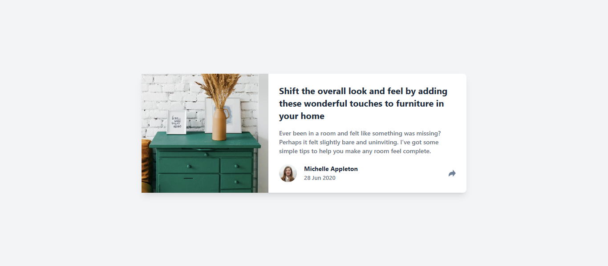

# Frontend Mentor - Article preview component solution

This is my solution to the [Article preview component challenge on Frontend Mentor](https://www.frontendmentor.io/challenges/article-preview-component-dYBN_pYFT). Frontend Mentor challenges help improve coding skills by building realistic projects.

## Table of contents

- [Overview](#overview)
  - [The challenge](#the-challenge)
  - [Screenshot](#screenshot)
  - [Links](#links)
- [My process](#my-process)
  - [Built with](#built-with)
  - [What I learned](#what-i-learned)
  - [Continued development](#continued-development)
  - [Useful resources](#useful-resources)
- [Author](#author)

## Overview

### The challenge

Users should be able to:

- View the optimal layout for the component depending on their device's screen size
- See the social media share links when they click the share icon

### Screenshot



### Links

- Solution URL: [View Solution on Frontend Mentor](https://your-solution-url.com)
- Live Site URL: [Visit Live Site](https://your-live-site-url.com)

## My process

### Built with

- Semantic HTML5 markup
- Tailwind CSS
- Flexbox
- Mobile-first workflow
- Vanilla JavaScript

### What I learned

During this project, I reinforced how to create **responsive layouts** using **Flexbox**, and I learned how to implement a **share button toggle** functionality with simple JavaScript event listeners.

Here’s an example of the toggle functionality:

```js
const shareButton = document.querySelector('.share-button');
const shareOptions = document.querySelector('.share-options');

shareButton.addEventListener('click', () => {
  shareOptions.classList.toggle('visible');
});


### Continued development

In future projects, I want to:

- Improve my accessibility practices (e.g., using aria-* attributes).

### Useful resources

- [Tailwind CSS Documentation](https://tailwindcss.com/) - This helped me with the styling.

## Author

- Website - [Amiko Elvis](https://www.your-site.com)
- Frontend Mentor - [@amikoelvis](https://www.frontendmentor.io/profile/amikoelvis)
- Twitter - [@ElvisAmiko](https://www.twitter.com/ElvisAmiko)

## Acknowledgments

Thank you to Frontend Mentor for providing this challenge.
```
